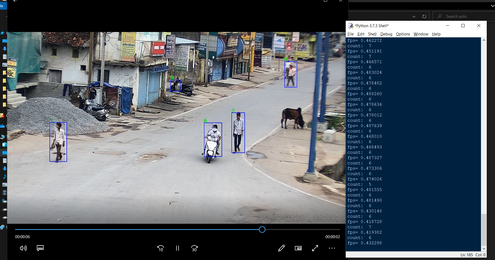
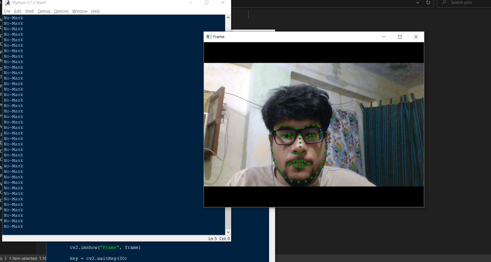

# Detections with YOLOv3

## How it Works!
`$cd src` 
Run `$ python Vidcap.py` 
After running code `output.avi` video will be saved in the given directory 
Download the yolo.h5 model from [here](https://pjreddie.com/darknet/yolo/)

## Output As Shown Below:
* Total people count is 7 at instance.

* Frame wise data will be stored in an [output.json](src/output.json) once the program get executed.

## Demo Program for face mask detection:

Run by typing `$ python face_mask.py`
* This code took basic coding with no dataset or model involved. It diplay whether the face has mask or not.

* Cover your face with mask or cloth and it will stop giving notification of having no mask.
