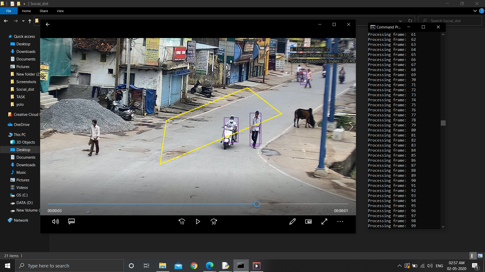

## How it Works:

Download all the requirements by: `$ pip install -r requirements.txt `  
Run: `$ python main.py --videopath <filename>.mp4` 

* OUTPUT:

* It is detecting the 1 meter violation so that social distancing would follow.
* Also determines the social distancing index with an average accuracy.
